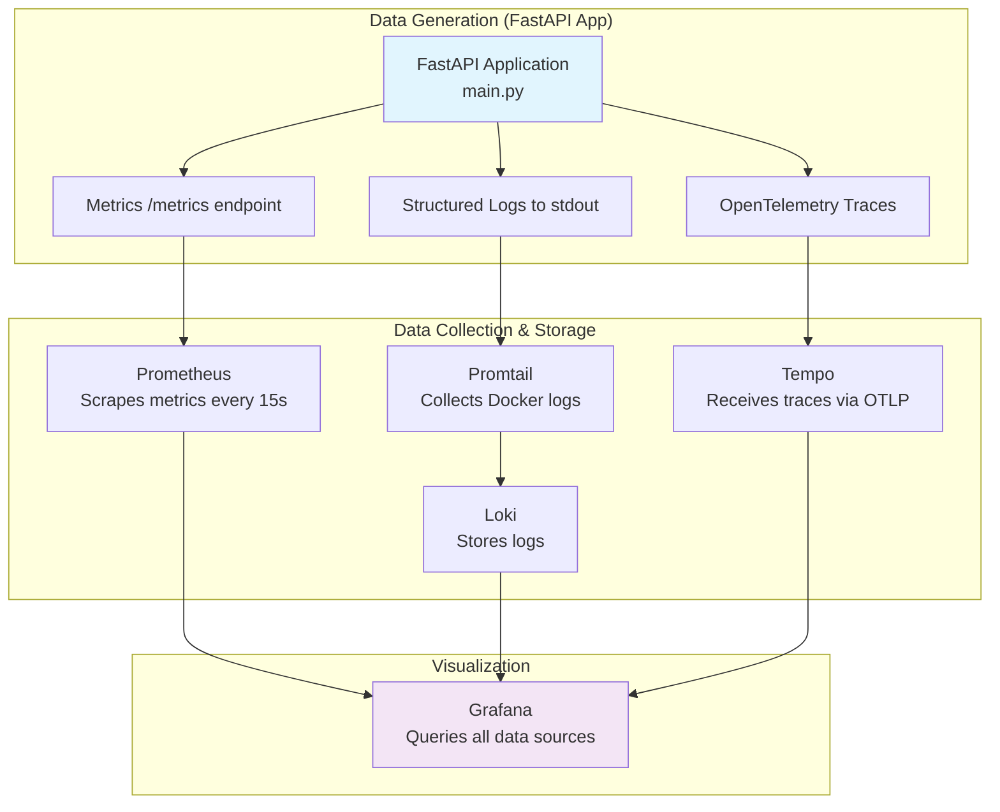

# Complete Data Flow: How Grafana Gets All Data 🔍

## 🎯 The Big Picture

Grafana acts as a **query interface** that pulls data from three separate storage systems. Your FastAPI app **generates** the data, specialized tools **collect and store** it, and Grafana **visualizes** it.



---

## 📊 1. METRICS PIPELINE: FastAPI → Prometheus → Grafana

### **Step 1: Data Generation (main.py)**
```python
# --- Prometheus Instrumentation ---
from prometheus_fastapi_instrumentator import Instrumentator
Instrumentator().instrument(app).expose(app)
```

**What this code does:**
- ✅ Creates `/metrics` endpoint on your FastAPI app
- ✅ Automatically tracks: request count, latency, status codes, concurrent requests
- ✅ Updates metrics in real-time for every HTTP request

**You can see the raw metrics:**
```bash
curl http://localhost:8000/metrics
```
Output:
```
# HELP fastapi_requests_total Total HTTP requests
# TYPE fastapi_requests_total counter
fastapi_requests_total{method="GET",path="/",status="200"} 42
fastapi_request_duration_seconds_sum{method="GET",path="/"} 12.5
```

### **Step 2: Data Collection (prometheus.yml)**
```yaml
global:
  scrape_interval: 15s    # ← How often to collect metrics
scrape_configs:
  - job_name: 'fastapi-app'
    static_configs:
      - targets: ['fastapi-app:8000']  # ← WHERE to scrape from
```

**What this config does:**
- ✅ Prometheus calls `http://fastapi-app:8000/metrics` every 15 seconds
- ✅ Stores time-series data in Prometheus database
- ✅ Makes data queryable with PromQL

### **Step 3: Data Visualization (grafana-datasources.yml)**
```yaml
- name: Prometheus
  type: prometheus
  access: proxy
  url: http://prometheus:9090  # ← WHERE Grafana queries metrics
  isDefault: true
```

**Grafana Metrics Queries:**
- Request rate: `rate(fastapi_requests_total[5m])`
- Latency P95: `histogram_quantile(0.95, fastapi_request_duration_seconds_bucket)`
- Error rate: `rate(fastapi_requests_total{status!~"2.."}[5m])`

---

## 📝 2. LOGS PIPELINE: FastAPI → Docker → Promtail → Loki → Grafana

### **Step 1: Data Generation (main.py)**
```python
# --- Logging Setup ---
logging.basicConfig(
    level=logging.INFO,
    format='%(asctime)s - %(name)s - %(levelname)s - %(message)s - trace_id=%(otelTraceID)s - span_id=%(otelSpanID)s',
)
logger = logging.getLogger(__name__)

# In your endpoints:
logger.info("Received request for root endpoint.")
logger.warning(f"Signup attempt for existing email: {user.email}")
```

**What happens:**
- ✅ FastAPI writes structured logs to `stdout`
- ✅ Docker captures these logs and stores them in `/var/lib/docker/containers/`
- ✅ Each log includes trace_id for correlation

### **Step 2: Data Collection (promtail-config.yml)**
```yaml
clients:
  - url: http://loki:3100/loki/api/v1/push   # ← WHERE to send collected logs

scrape_configs:
  - job_name: containers
    docker_sd_configs:
      - host: unix:///var/run/docker.sock    # ← HOW to discover containers
        refresh_interval: 5s
    relabel_configs:
      - source_labels: ['__meta_docker_container_name']
        regex: '/(.*)'
        target_label: 'container_name'       # ← ADD container name as label
```

**What this config does:**
- ✅ Discovers all Docker containers via Docker socket
- ✅ Reads log files from `/var/lib/docker/containers/*/` 
- ✅ Adds container metadata (name, labels) to each log entry
- ✅ Ships logs to Loki with structured data

**Your docker-compose.yml enables this:**
```yaml
volumes:
  - /var/run/docker.sock:/var/run/docker.sock        # ← Container discovery
  - /var/lib/docker/containers:/var/lib/docker/containers:ro  # ← Log file access
```

### **Step 3: Data Storage & Querying**
```yaml
# In grafana-datasources.yml
- name: Loki
  type: loki  
  url: http://loki:3100  # ← WHERE Grafana queries logs
```

**Grafana Log Queries:**
- All app logs: `{container_name="fastapi-app"}`
- Error logs: `{container_name="fastapi-app"} |= "ERROR"`
- Logs for specific trace: `{container_name="fastapi-app"} |= "trace_id=abc123"`

---

## 🔍 3. TRACES PIPELINE: FastAPI → Tempo → Grafana

### **Step 1: Data Generation (main.py)**
```python
# --- OpenTelemetry Tracing Setup ---
from opentelemetry.exporter.otlp.proto.grpc.trace_exporter import OTLPSpanExporter

otlp_exporter = OTLPSpanExporter(endpoint="tempo:4317", insecure=True)
provider.add_span_processor(BatchSpanProcessor(otlp_exporter))

# In each endpoint:
@app.get("/")
def read_root():
    with tracer.start_as_current_span("read_root_span"):  # ← Creates trace span
        logger.info("Received request for root endpoint.")
        return {"message": "Hello sagar, Observability World!"}
```

**What this code does:**
- ✅ Creates trace spans for each request
- ✅ Sends traces to Tempo via OTLP (OpenTelemetry Protocol)
- ✅ Each span includes timing, metadata, and relationships

### **Step 2: Data Collection (tempo-config.yaml)**
```yaml
distributor:
  receivers:
    otlp:
      protocols:
        grpc:
          endpoint: 0.0.0.0:4317  # ← RECEIVE traces from FastAPI here

storage:
  trace:
    backend: local
    local:
      path: /tmp/tempo/traces   # ← STORE traces here
```

**What this config does:**
- ✅ Listens for OTLP traces on port 4317
- ✅ Stores traces in local storage
- ✅ Makes traces queryable by trace ID

### **Step 3: Data Visualization & Correlation (grafana-datasources.yml)**
```yaml
- name: Tempo
  type: tempo
  url: http://tempo:3200  # ← WHERE Grafana queries traces
  jsonData:
    tracesToLogs:
      datasourceUid: 'Loki'                    # ← Link traces to logs
      filterByTraceID: true                    # ← Filter logs by trace ID
      mappedTags: [{ key: 'service.name', value: 'container_name' }]
```

**Correlation Magic:**
- Click a trace in Grafana → automatically shows related logs
- Trace ID in logs → click to see complete request journey

---

## 🔗 4. CORRELATION: The Magic Connection

### **The Key Code (main.py middleware):**
```python
@app.middleware("http") 
async def log_and_trace_middleware(request: Request, call_next):
    span = trace.get_current_span()
    trace_id = span.get_span_context().trace_id
    
    class TraceIdFilter(logging.Filter):
        def filter(self, record):
            record.otelTraceID = format(trace_id, 'x')  # ← THIS IS THE MAGIC
            return True
    
    logging.getLogger().addFilter(TraceIdFilter())
```

**What happens:**
1. ✅ Every HTTP request gets a unique trace ID
2. ✅ All logs during that request include the same trace ID
3. ✅ Grafana can correlate: "Show me all logs for trace abc123"

---

## 📋 Config File Responsibilities Summary

| Config File | Purpose | What It Configures | Data Flow |
|-------------|---------|-------------------|-----------|
| **main.py** | 🎯 **Data Generation** | Instruments FastAPI to generate metrics, logs, traces | App → Various endpoints/outputs |
| **prometheus.yml** | 📊 **Metrics Collection** | WHERE and HOW OFTEN to scrape metrics | FastAPI `/metrics` → Prometheus DB |
| **promtail-config.yml** | 📝 **Log Collection** | WHICH containers to monitor, WHERE to send logs | Docker logs → Loki |
| **tempo-config.yaml** | 🔍 **Trace Collection** | WHERE to receive traces, HOW to store them | OTLP traces → Tempo DB |
| **grafana-datasources.yml** | 📈 **Data Visualization** | WHERE to query each data type, HOW to correlate | All DBs → Grafana dashboards |

---

## 🚀 Complete Data Flow Example

### **When you make a request to `/users/me/`:**

1. **FastAPI (main.py)**:
   ```python
   @app.get("/users/me/")
   async def read_users_me(current_user: models.User = Depends(auth.get_current_active_user)):
       with tracer.start_as_current_span("get_current_user_span"):  # ← Creates trace
           logger.info(f"Fetching profile for user: {current_user.email}")  # ← Creates log
           return current_user
   ```

2. **Data Generated**:
   - **Metrics**: Request count +1, latency recorded, status code 200
   - **Logs**: `"Fetching profile for user: john@example.com - trace_id=abc123"`
   - **Traces**: Span with timing, operation name, trace ID abc123

3. **Collection**:
   - **Prometheus** scrapes `/metrics` every 15s → stores metrics
   - **Promtail** reads Docker logs → ships to **Loki**
   - **Tempo** receives trace via OTLP → stores trace

4. **Grafana Visualization**:
   - **Metrics Dashboard**: Shows request rate, latency graphs
   - **Logs View**: Shows `"Fetching profile..."` with trace_id
   - **Traces View**: Shows complete request span timeline
   - **Correlation**: Click trace abc123 → see all related logs

---

## 🔧 How Each Service Gets Data

### **Prometheus Gets Metrics:**
```bash
# Prometheus runs this every 15s:
curl http://fastapi-app:8000/metrics
```

### **Loki Gets Logs:**
```bash
# Promtail does this continuously:
# 1. Discovers containers via Docker socket
# 2. Reads log files from /var/lib/docker/containers/
# 3. Ships to Loki via HTTP POST
curl -X POST http://loki:3100/loki/api/v1/push
```

### **Tempo Gets Traces:**
```bash
# Your FastAPI app does this for each request:
# Sends OTLP trace data to tempo:4317 via gRPC
```

### **Grafana Queries Everything:**
```bash
# For metrics:
curl http://prometheus:9090/api/v1/query?query=fastapi_requests_total

# For logs:  
curl http://loki:3100/loki/api/v1/query?query={container_name="fastapi-app"}

# For traces:
curl http://tempo:3200/api/search
```

---

## 🎯 Key Takeaways

### **Your FastAPI App Is The Source:**
- `main.py` generates ALL the observability data
- Each endpoint creates metrics, logs, and traces automatically

### **Config Files Are The Plumbing:**
- **prometheus.yml**: "Scrape metrics from FastAPI every 15s"
- **promtail-config.yml**: "Collect Docker logs and send to Loki"  
- **tempo-config.yaml**: "Listen for traces from FastAPI"
- **grafana-datasources.yml**: "Query data from all three sources"

### **Docker-Compose Is The Orchestrator:**
- Starts all services with correct networking
- Provides volume mounts for data access
- Enables service-to-service communication

### **The Correlation Secret:**
The middleware in `main.py` that injects trace IDs into logs is what enables the powerful correlation features in Grafana - you can jump from metrics → traces → logs seamlessly!

---

## 🧪 Testing The Complete Flow

### **1. Generate Traffic:**
```bash
# Start load testing
locust -f locustfile.py --host=http://localhost:8000 --users 5 --spawn-rate 1
```

### **2. Check Each Data Source:**

**Metrics (Raw):**
```bash
curl -s http://localhost:8000/metrics | grep fastapi_requests_total
```

**Metrics (Prometheus):**
```bash
curl -s "http://localhost:9090/api/v1/query?query=fastapi_requests_total" | jq
```

**Logs (Loki):**
```bash
curl -s "http://localhost:3100/loki/api/v1/labels" | jq
```

**Traces (Tempo):**
```bash
curl -s http://localhost:3200/api/echo
```

### **3. Verify in Grafana:**
- **Explore → Prometheus**: Query `rate(fastapi_requests_total[5m])`
- **Explore → Loki**: Query `{container_name="fastapi-app"}`  
- **Explore → Tempo**: Search for recent traces

---

## 🔍 Detailed Config Analysis

### **prometheus.yml - Metrics Collection**
```yaml
global:
  scrape_interval: 15s     # ← Collect metrics every 15 seconds
scrape_configs:
  - job_name: 'fastapi-app' 
    static_configs:
      - targets: ['fastapi-app:8000']  # ← Target: http://fastapi-app:8000/metrics
```

**Result**: Prometheus continuously pulls metrics and builds time-series database.

### **promtail-config.yml - Log Collection**  
```yaml
clients:
  - url: http://loki:3100/loki/api/v1/push   # ← Send logs here

scrape_configs:
  - job_name: containers
    docker_sd_configs:
      - host: unix:///var/run/docker.sock    # ← Discover containers
        refresh_interval: 5s
    relabel_configs:
      - source_labels: ['__meta_docker_container_name']
        regex: '/(.*)'
        target_label: 'container_name'       # ← Add container name label
```

**Result**: Promtail discovers your FastAPI container, reads its logs, adds metadata, ships to Loki.

### **tempo-config.yaml - Trace Collection**
```yaml
distributor:
  receivers:
    otlp:
      protocols:
        grpc:
          endpoint: 0.0.0.0:4317  # ← Listen for traces here
```

**Result**: Tempo receives OTLP traces from your FastAPI OpenTelemetry exporter.

### **grafana-datasources.yml - Unified Querying**
```yaml
datasources:
  - name: Prometheus
    url: http://prometheus:9090    # ← Query metrics here
  - name: Loki  
    url: http://loki:3100         # ← Query logs here
  - name: Tempo
    url: http://tempo:3200        # ← Query traces here
    jsonData:
      tracesToLogs:
        datasourceUid: 'Loki'     # ← Enable trace→log correlation
        filterByTraceID: true
```

**Result**: Grafana can query all three data sources and correlate data using trace IDs.

---

## 🎯 The Complete Request Journey

When someone hits `/users/me/`:

### **1. FastAPI Processing (main.py):**
```python
# Middleware creates trace context
span = trace.get_current_span()
trace_id = span.get_span_context().trace_id  # e.g., "a1b2c3d4"

# Endpoint execution  
with tracer.start_as_current_span("get_current_user_span"):
    logger.info(f"Fetching profile for user: {current_user.email}")
```

### **2. Data Output:**
- **Metrics**: `fastapi_requests_total{method="GET",path="/users/me/",status="200"} +1`
- **Logs**: `"2025-08-27 10:30:15 - INFO - Fetching profile for user: john@example.com - trace_id=a1b2c3d4"`  
- **Traces**: Span with trace_id=a1b2c3d4, duration=45ms, operation="get_current_user_span"

### **3. Collection (Every 15s for metrics, real-time for logs/traces):**
- **Prometheus**: Scrapes updated metrics from `/metrics`
- **Promtail**: Reads new log line, ships to Loki
- **Tempo**: Already received trace via OTLP

### **4. Grafana Correlation:**
- View metrics → see request spike
- Click trace a1b2c3d4 → see 45ms duration  
- Auto-filter logs → see "Fetching profile..." entry
- **All connected by trace_id=a1b2c3d4**

This is **enterprise-grade observability** - you can debug any issue by correlating metrics, logs, and traces!