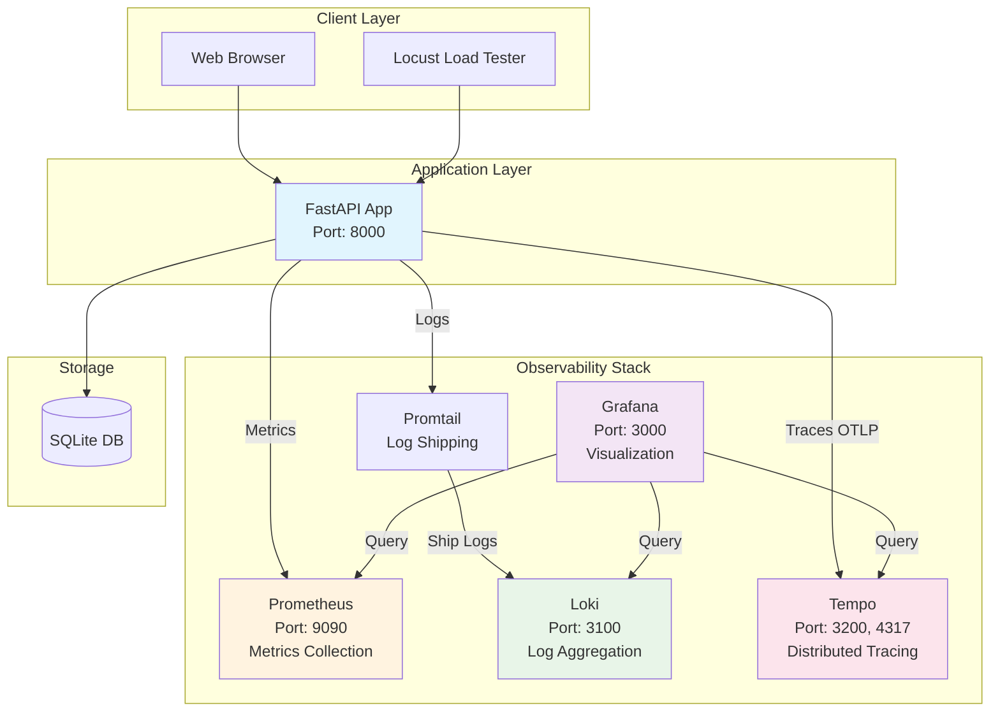

# FastAPI Observability Stack 🔍

A complete production-ready observability stack demonstrating **Metrics, Logs, and Traces** (the three pillars of observability) using FastAPI, Prometheus, Grafana, Loki, and Tempo.

## 📸 Screenshots & Results

> **Note**: Place your output images in the `/screenshots/` directory to showcase the results:

```
screenshots/
├── grafana-dashboard-overview.png
├── prometheus-metrics.png
├── loki-logs-view.png
├── tempo-traces.png
├── correlated-view.png
└── load-test-results.png
```

**Expected Results Preview:**
- **Grafana Dashboard**: Real-time metrics, logs, and traces in unified view
- **Request Metrics**: Response times, request rates, error rates
- **Distributed Traces**: Complete request journey visualization  
- **Correlated Logs**: Searchable application logs linked to traces
- **Load Testing**: Performance under simulated traffic

---

## 🏗️ Architecture Overview



---

## 🚀 Quick Start

### Prerequisites
- Docker & Docker Compose
- Python 3.8+ (for load testing)
- 8GB+ RAM recommended

### 1. Clone & Start Services
```bash
git clone <your-repo>
cd fastapi-observability-stack

# Start the complete stack
docker-compose up -d

# Verify all services are running
docker-compose ps
```

### 2. Generate Load Traffic
```bash
# Install load testing tool
pip install locust

# Start load testing (in separate terminal)
locust -f locustfile.py --host=http://localhost:8000 --users 10 --spawn-rate 2
```

### 3. Access Dashboards
| Service | URL | Credentials |
|---------|-----|-------------|
| **Grafana** | http://localhost:3000 | admin/admin |
| **FastAPI** | http://localhost:8000 | - |
| **Prometheus** | http://localhost:9090 | - |
| **FastAPI Docs** | http://localhost:8000/docs | - |

### 4. Explore Observability
1. **Grafana**: Create dashboards for metrics, logs, traces
2. **Prometheus**: Query raw metrics  
3. **Load Test**: Watch real-time metrics during traffic simulation

---

## 📁 File Structure & Purpose

```
├── app/
│   ├── __init__.py              # Python package marker
│   ├── main.py                  # 🎯 FastAPI app with observability
│   ├── auth.py                  # 🔐 JWT authentication system
│   ├── models.py                # 🗃️ SQLAlchemy database models
│   ├── schemas.py               # 📝 Pydantic validation schemas
│   ├── database.py              # 🔗 Database connection setup
│   └── crud.py                  # 📊 Database operations
├── config/
│   ├── prometheus.yml           # ⚙️ Prometheus scraping config
│   ├── promtail-config.yml      # ⚙️ Log shipping configuration
│   ├── tempo-config.yaml        # ⚙️ Distributed tracing setup
│   └── grafana-datasources.yml  # ⚙️ Grafana data source config
├── docker-compose.yml           # 🐳 Complete stack orchestration
├── requirements.txt             # 📦 Python dependencies
├── locustfile.py               # 🚦 Load testing scenarios
├── Dockerfile                   # 🐳 FastAPI container build
└── screenshots/                 # 📸 Output images directory
```

---

## 🔧 Detailed File Analysis

### Core Application Files

#### `main.py` - FastAPI Application Heart
**Purpose**: Main application with complete observability instrumentation

**Key Features**:
```python
# OpenTelemetry Tracing Setup
from opentelemetry import trace
from opentelemetry.exporter.otlp.proto.grpc.trace_exporter import OTLPSpanExporter

# Prometheus Metrics Auto-instrumentation  
from prometheus_fastapi_instrumentator import Instrumentator

# Structured Logging with Trace Correlation
logging.basicConfig(
    format='%(asctime)s - %(name)s - %(levelname)s - %(message)s - trace_id=%(otelTraceID)s'
)
```

**Endpoints**:
- `GET /` - Health check endpoint
- `POST /signup/` - User registration  
- `POST /login/` - JWT token authentication
- `GET /users/me/` - Protected user profile

#### `auth.py` - Security Layer
**Purpose**: JWT-based authentication with BCrypt password hashing

**Components**:
- Password verification and hashing
- JWT token creation and validation
- OAuth2 integration for FastAPI
- User session management

#### `database.py` & `models.py` - Data Layer
- **database.py**: SQLAlchemy engine and session configuration
- **models.py**: User model with SQLAlchemy ORM

#### `schemas.py` - API Contracts
**Purpose**: Pydantic models for request/response validation
- Input validation
- Response serialization
- Type safety

#### `crud.py` - Database Operations
**Purpose**: Database CRUD operations
- User creation with password hashing
- User retrieval by email

### Infrastructure Configuration

#### `docker-compose.yml` - Service Orchestration
**Services & Ports**:

| Service | Internal Port | External Port | Purpose |
|---------|---------------|---------------|---------|
| **fastapi-app** | 8000 | 8000 | Main application |
| **prometheus** | 9090 | 9090 | Metrics collection |
| **grafana** | 3000 | 3000 | Visualization dashboard |
| **loki** | 3100 | 3100 | Log aggregation |
| **tempo** | 3200, 4317 | 3200, 4317 | Distributed tracing |
| **promtail** | 9080 | - | Log shipping (internal) |

#### Configuration Files Deep Dive

**`prometheus.yml`**:
```yaml
global:
  scrape_interval: 15s
scrape_configs:
  - job_name: 'fastapi-app'
    static_configs:
      - targets: ['fastapi-app:8000']
```
- Scrapes FastAPI metrics every 15 seconds
- Targets the application container

**`promtail-config.yml`**:
- Collects Docker container logs
- Ships logs to Loki with metadata
- Parses container information

**`tempo-config.yaml`**:
- OTLP receiver configuration
- Local trace storage
- Metrics generator integration

**`grafana-datasources.yml`**:
- Pre-configures all data sources
- Enables trace-to-logs correlation
- Sets up unified observability view

### Testing & Load Generation

#### `locustfile.py` - Realistic Load Testing
**User Journey Simulation**:
```python
class APIUser(HttpUser):
    def on_start(self):
        # 1. User signup
        self.client.post("/signup/", json={"email": self.email, "password": self.password})
        # 2. User login  
        response = self.client.post("/login/", json={"email": self.email, "password": self.password})
        # 3. Extract JWT token
        self.token = response.json()["access_token"]
    
    @task
    def authenticated_requests(self):
        # Realistic user behavior with authentication
        self.client.get("/users/me/", headers={"Authorization": f"Bearer {self.token}"})
```

---

## 📊 Data Flow Architecture

### 1. **Metrics Pipeline** 
```
FastAPI Request → Prometheus Instrumentator → Prometheus Storage → Grafana Visualization
```

**What's Captured**:
- Request count and rate
- Response time percentiles (P50, P95, P99)
- HTTP status code distribution
- Concurrent request count

### 2. **Logging Pipeline**
```
FastAPI Logs → Docker stdout → Promtail → Loki Storage → Grafana Search
```

**Log Correlation**:
- Trace ID injection in log records
- Structured JSON logging
- Container metadata enrichment

### 3. **Tracing Pipeline** 
```
FastAPI (OpenTelemetry) → OTLP Exporter → Tempo Storage → Grafana Trace View
```

**Trace Spans**:
- HTTP request spans
- Database operation spans
- Authentication spans
- Custom business logic spans

### 4. **Unified Observability**
The real power is in **correlation**:
- **Metric Alert** → Drill down to specific **Traces** → View related **Logs**
- **Error Log** → Find corresponding **Trace** → See **Metrics** context
- **Slow Request** → Analyze **Trace** → Identify bottleneck in **Logs**

---

## 🎯 Use Cases & Scenarios

### Development Scenarios

#### 1. **Performance Investigation**
```
High Latency Alert in Grafana → View Traces → Identify Slow Database Query → Check Logs for Error Details
```

#### 2. **Error Debugging**  
```
Error Rate Spike → Filter Traces by Error → Correlate with Application Logs → Root Cause Analysis
```

#### 3. **Capacity Planning**
```
Monitor Request Rate Trends → Analyze Resource Usage → Plan Scaling Strategy
```

#### 4. **Feature Impact Analysis**
```
Deploy New Feature → Monitor Metrics Change → Trace User Journey → Validate Performance
```

---

## 🚦 Running Different Scenarios

### Scenario 1: Normal Traffic
```bash
locust -f locustfile.py --host=http://localhost:8000 --users 5 --spawn-rate 1 -t 5m
```

### Scenario 2: Load Spike
```bash
locust -f locustfile.py --host=http://localhost:8000 --users 50 --spawn-rate 10 -t 2m
```

### Scenario 3: Sustained Load
```bash
locust -f locustfile.py --host=http://localhost:8000 --users 20 --spawn-rate 2 -t 30m
```

---

## 📈 Expected Grafana Dashboards

### 1. **Application Metrics Dashboard**
- Request Rate (req/sec)
- Response Time Distribution  
- Error Rate by Endpoint
- Active Users Count

### 2. **Infrastructure Dashboard**
- Container Resource Usage
- Database Connection Pool
- Memory and CPU Metrics

### 3. **Business Metrics Dashboard** 
- User Signup Rate
- Authentication Success Rate
- API Usage Patterns

---

## 🐛 Troubleshooting

### Common Issues

#### Services Won't Start
```bash
# Check port conflicts
netstat -tulpn | grep :3000
netstat -tulpn | grep :9090

# Check Docker resources
docker system df
docker system prune  # if needed
```

#### No Metrics in Grafana
1. Verify Prometheus targets: http://localhost:9090/targets
2. Check FastAPI metrics endpoint: http://localhost:8000/metrics
3. Verify network connectivity between containers

#### Missing Traces
1. Check Tempo configuration
2. Verify OTLP exporter endpoint
3. Look for OpenTelemetry initialization errors in logs

#### No Logs in Loki
1. Check Promtail service status
2. Verify Docker log driver configuration  
3. Check Loki ingestion endpoint

---

## 🔒 Security Considerations

### Production Checklist
- [ ] Change default Grafana credentials
- [ ] Use environment variables for secrets
- [ ] Implement proper JWT secret rotation
- [ ] Enable HTTPS/TLS for all services
- [ ] Set up proper authentication for Prometheus/Grafana
- [ ] Configure network security groups
- [ ] Enable audit logging

### Current Security Features
- BCrypt password hashing
- JWT token authentication  
- Input validation with Pydantic
- SQL injection protection via SQLAlchemy ORM

---

## 📚 Learning Resources

### Understanding the Stack
- [OpenTelemetry Documentation](https://opentelemetry.io/docs/)
- [Prometheus Best Practices](https://prometheus.io/docs/practices/)
- [Grafana Tutorials](https://grafana.com/tutorials/)

### Advanced Topics
- Distributed tracing patterns
- SLA/SLI/SLO implementation
- Alert manager configuration
- Custom metrics creation

---

## 🚀 Next Steps & Extensions

### For Production Deployment
1. **Infrastructure as Code**: Terraform/Kubernetes manifests
2. **Service Mesh**: Istio/Linkerd integration  
3. **Advanced Alerting**: AlertManager rules
4. **Log Parsing**: Custom Promtail pipelines
5. **Dashboards**: Pre-built Grafana dashboards

### For Development
1. **Custom Metrics**: Business-specific measurements
2. **Error Tracking**: Sentry integration
3. **Performance Profiling**: py-spy integration
4. **Database Monitoring**: PostgreSQL exporter

---

## 📝 Contributing

### Adding New Features
1. Add instrumentation to new endpoints
2. Create corresponding test scenarios in Locust
3. Update dashboard configurations
4. Document expected metrics/traces

### Testing Changes
1. Start the stack: `docker-compose up -d`
2. Run load tests: `locust -f locustfile.py --host=http://localhost:8000`
3. Verify observability data in Grafana
4. Update screenshots in `/screenshots/` directory

---

## 📄 License

MIT License - Feel free to use this as a reference for your observability implementations!

---

**🎉 Happy Observing!** This stack provides a solid foundation for understanding how modern applications are monitored in production. The correlation between metrics, logs, and traces gives you superpowers for debugging and performance optimization.
